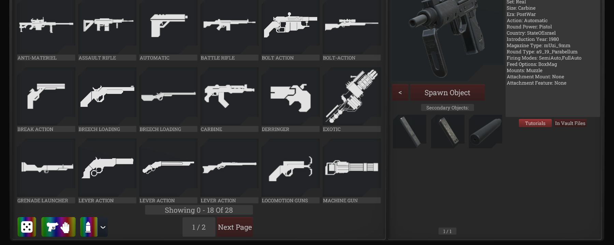

# Gundomizer

Randomize items directly in **Item Spawner V2**, including the **toolbox tablet**, in classic and tag-search modes.

## Features

- **Random item:** roll from the current category and its subcategories, or your selected tags, across all pages.
- **Compatible item:** roll items that fit what you're holding, including magazines, attachments, and installed rail adapters.
- **Random ammo:** roll a compatible ammo variant. The arrow beside it opens the variant toggles.
- **Spawn or preview:** spawn immediately, or select a result to inspect, accept, or reroll.
- **Auto-fill:** replace loaded rounds and fill the held magazine or weapon, while still spawning the loose round.
- **Continuous search:** shows loading progress; click the active button again to cancel.

## Mod compatibility

Supports modded items, including **Modul / Modular Workshop** content and **OtherLoader**'s custom item IDs.

## Optimization

A background metadata index checks compatibility without loading entire assets just to inspect their connectors. It's saved between launches and updates changed packages, making rolls faster as indexing completes.

## Mod Options

- **Spawn Item Instantly** — ON: spawn immediately; OFF: preview first.
- **Auto Fill Held Item** — ON: refill with the rolled ammo after spawning.
- **Persistent Connector Index** — ON: build and reuse the metadata cache.
- **Reset Metadata Indexing** — OFF: clear and rebuild the cache once, then switch itself off.

Edit `quaternion.gundomizer.cfg` through your mod manager's Config Editor. Requires **BepInExPack H3VR**.
